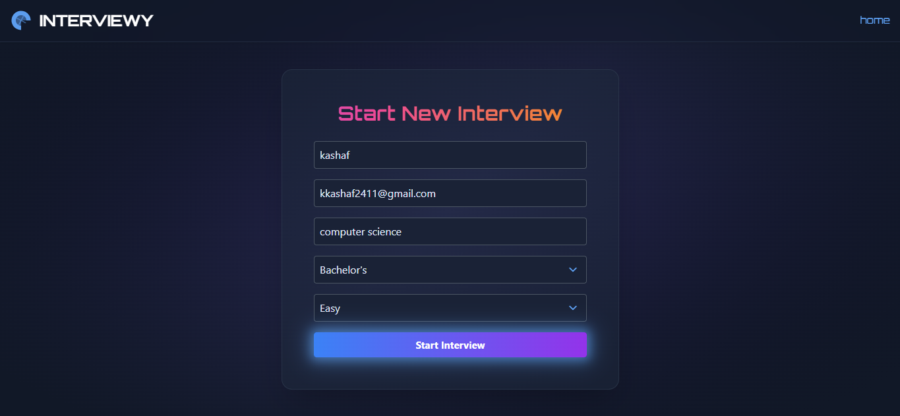
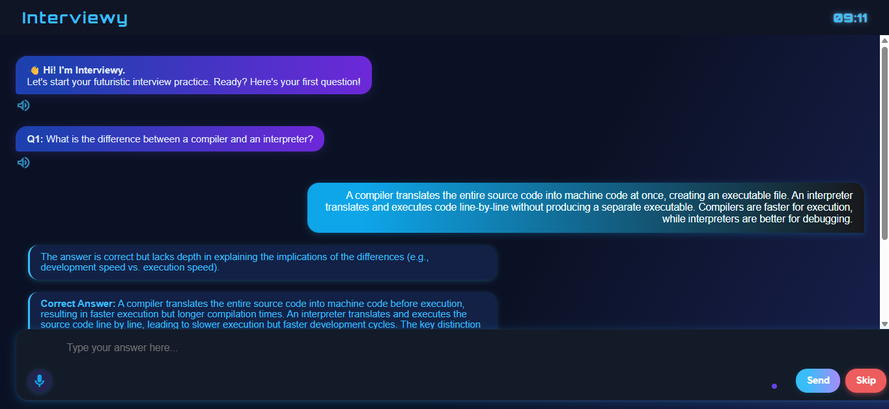
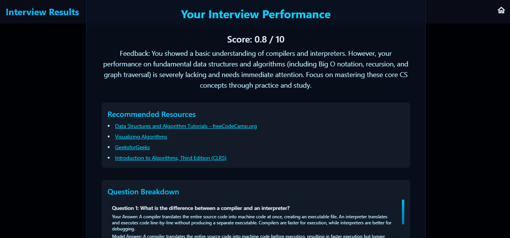

<h1 align="center">🚀 Interviewy – AI Interview Preparation Chatbot</h1>
<h3 align="center">Your Complete AI-Powered Mock Interview & Career Prep Platform</h3>

<p align="center">
  <b>Practice. Improve. Ace Your Next Job.</b><br>
  
  
  
  
</p>

---

## 🌟 Why Interviewy – AI Interview Preparation Chatbot?

**Interviewy** is more than just a mock interview tool.  
It’s an intelligent, AI-powered chatbot that simulates real technical and HR interviews, analyzes your answers with semantic understanding, adapts to your field and difficulty, and gives you everything you need to nail your next job interview — all in one place!

---

## ✨ Features

- **🤖 AI-Generated Questions:** Technical and behavioral questions tailored by AI to your field, major, and difficulty.
- **🎯 Semantic Answer Analysis:** Advanced contextual evaluation for depth, relevance, and clarity.
- **💬 Real-Time Feedback & Scoring:** Instant, actionable feedback and scoring after each response.
- **📩 Email Reports:** Receive your results and improvement analysis directly in your inbox.
- **📈 PDF Report Generation:** Download beautiful, detailed interview reports to keep or share.
- **🎙️ Voice Answering:** Answer questions using your microphone with speech-to-text.
- **🗣️ AI Voice Questions:** Listen as questions are read aloud by an AI for a real interview feel.
- **🔗 Personalized Learning Links:** Smart resource recommendations based on your performance and weak areas.
- **🎓 Major & Difficulty Customization:** Questions adapt to your chosen field/major and desired challenge level.
- **⏰ Interview Timer:** Stay focused and practice under realistic time constraints.
- **🕵️ Cheat Detection:** Detects tab-switching and other attempts to break interview flow.
- **⚡ Modern, Responsive UI:** Clean, mobile-friendly design for seamless use anywhere.
- **🔒 Privacy-First:** Your data stays local—nothing is sent to external servers.

---

## 🖼️ Screenshots

<p align="center">
  
  
  
  
</p>

---

## 🚀 Quick Start

### 1. Clone & Setup

```bash
git clone https://github.com/kashafkhann/interviewy-ai-interview-preparation-chatbot.git
cd interviewy-ai-interview-preparation-chatbot
```

### 2. Backend Setup (Flask)

> **Requires:** Python 3.8+, MySQL

```bash
python -m venv venv
source venv/bin/activate        # or venv\Scripts\activate on Windows
pip install -r requirements.txt
```

- Update your API keys, database credentials, and email configuration in the configuration section of `app.py`.
- Ensure MySQL is running and credentials in your code are correct.

### 3. Frontend

- All HTML files are in `/static/`
- Open `index.html` in your browser, or access via Flask at [http://127.0.0.1:5000/](http://127.0.0.1:5000/)

---

## ⚙️ Configuration

- **API keys:**  
  - `GEMINI_API_KEY` for Google Gemini
  - `GMAIL_SENDER`, `GMAIL_PASSWORD` for report emails
- **Database:**  
  - Edit host/user/password in your configuration section

---

## 🏗️ Project Structure

```
interviewy-ai-interview-preparation-chatbot/
├── app.py
├── requirements.txt
├── static/
│   ├── index.html
│   ├── home.html
│   ├── int.html
│   ├── result.html
├── screenshots/
│   ├── landing page.png
│   ├── home.png
│   ├── interview.png
│   └── results.png
├── README.md
├── .gitignore
```

---

## 🎁 Features In-Depth

| Feature                        | Description                                                                                  |
|--------------------------------|----------------------------------------------------------------------------------------------|
| AI-Generated Questions         | 10+ questions per session, customized for your field, major, and chosen difficulty           |
| Semantic Answer Analysis       | Answers are evaluated for meaning, not just keywords                                         |
| Real-Time Feedback             | See your score and detailed feedback after each answer                                       |
| PDF & Email Reporting          | Receive a shareable PDF and complete results in your email inbox                             |
| Voice Answering                | Answer out loud using your microphone (speech-to-text)                                       |
| AI Voice Questions             | Listen to questions read aloud for a true interview feel                                     |
| Cheat Detection                | Warns and ends interview if browser tab/window is left too often                             |
| Personalized Resource Links    | Get recommended links and resources tailored to your answers and improvement areas           |
| Timer                          | Practice under time pressure with a visible countdown timer                                  |
| Modern UI                      | Enjoy a clean, responsive interface on both desktop and mobile                               |
| Privacy-First                  | All data stays local – nothing is uploaded or shared                                         |

---

## 📝 License

This project is licensed under the [MIT License](LICENSE).

---

## 💡 FAQ

**Q:** Can I use Interviewy for any subject?  
**A:** Yes! Just enter your major or degree — Interviewy adapts the questions accordingly.

**Q:** Is my data safe?  
**A:** 100%. No cloud storage, your data stays on your machine.

**Q:** Can I get a PDF or email report?  
**A:** Yes! At the end of your interview, you get a PDF and a summary sent to your email.

**Q:** Does it work on mobile?  
**A:** Yes, the UI is fully responsive for phones and tablets.

**Q:** I want to run this for my students/team.  
**A:** Go for it! See [MIT LICENSE](LICENSE) for terms.

---

## 🤝 Contributing

Pull requests, feature ideas, and bug reports are welcome!  
Want to collaborate or need a custom version?  
[Open an issue](https://github.com/kashafkhann/interviewy-ai-interview-preparation-chatbot/issues) or [email me](mailto:kkashaf2411@gmail.com).

---

## 🌈 Show Some Love

If you find Interviewy helpful, please ⭐ star this repo!  
It motivates me to keep building cool stuff.

---

<p align="center">
  <b>Made with ❤️ by Kashaf Khan</b>
</p>